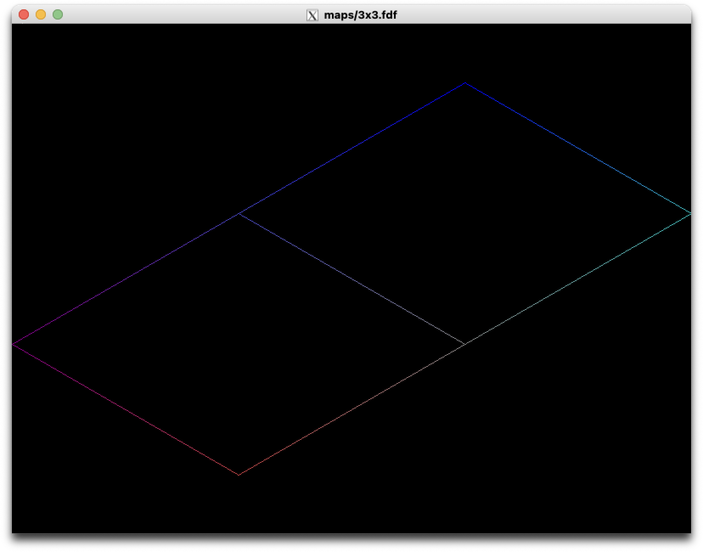
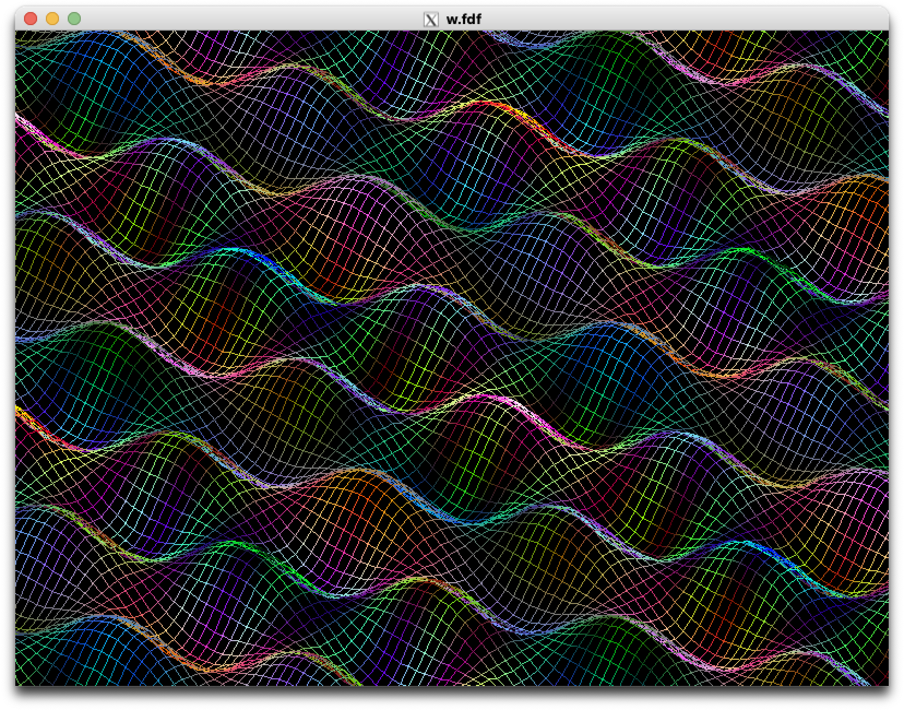
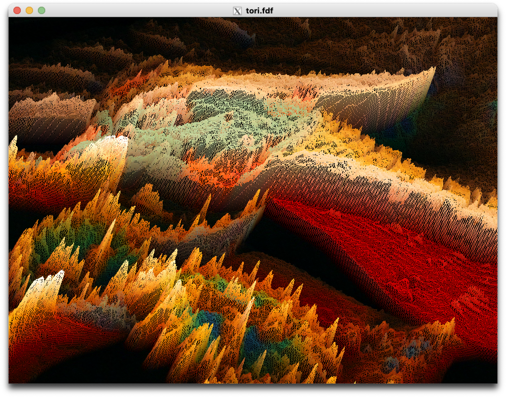

# FDF

## is 何

地形データをワイヤーフレームで 3D 表示するもの。

## もう少し詳しく

2 次元格子上の高度マップとして与えられた地形データを, 4 隣接する点間を結んだワイヤーフレームとして 3D 表示する。\
投影には透視投影を用いる。

## 使い方

まず`make`すると実行ファイル`fdf`が作成されるので,

```
$ ./fdf [some_map.fdf]
```

という形で地形データのファイルを指定して起動する。

## 地形データの書式

ファイル名は`*.fdf`という形式でなければならない。

中身については実例を見た方が早い。

```
0,0x880088 0,0x4444bb 0,0x0000ff
0,0xbb4444 0,0x888888 0,0x44bbbb
```

これは, x 方向のサイズが 3, y 方向のサイズが 2 の格子点領域を表している。\
`0,0xbb4444`は, 対応する格子点の高度が 0 で, 色が`0xbb4444`であることを表現している。\
`0,0xbb4444`は 2 行 1 列の位置にあるので, 対応する格子点は (x, y) = (0, 1).

このマップファイルを表示すると、以下のようになる。



## 操作方法

- Q キー: 終了
  - ウィンドウの閉じるボタンを押しても終了する
- マウスドラッグ: 移動
  - WASD キーでも移動可能
- 左右キー: Z 軸まわりの回転
- 上下キー: X 軸まわりの回転
  - 非直感的なので注意
- Z キー: 高低差を大きくする
- X キー: 高低差を小さくする
  - 押し続けると高低差ゼロを超えてマイナスになる

## デモ




